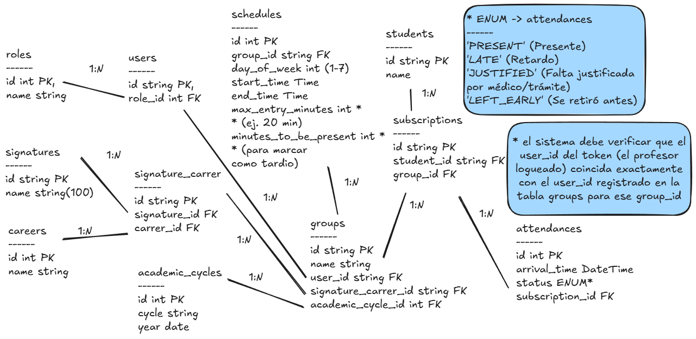
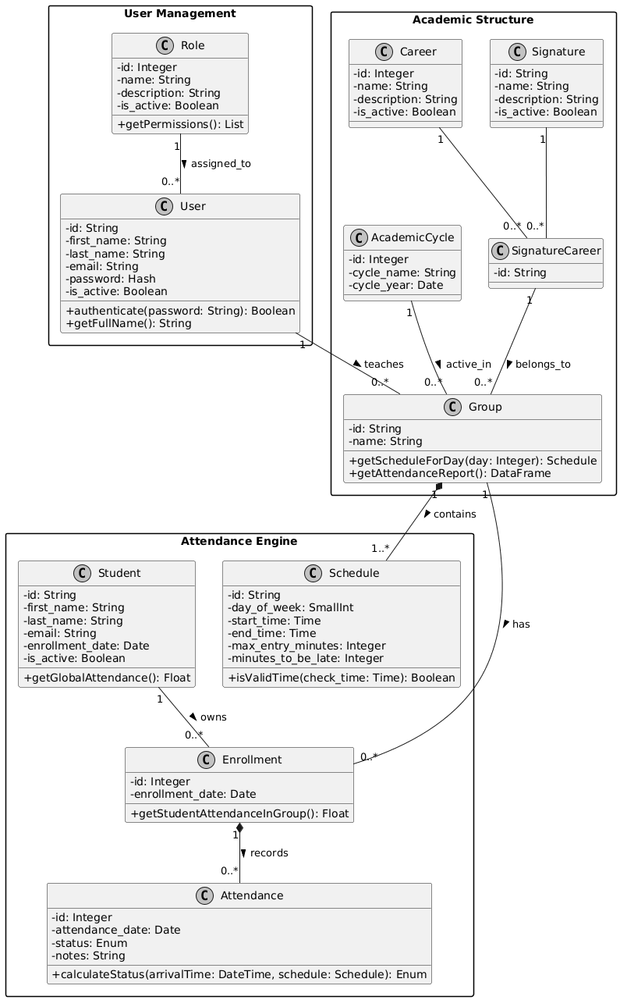
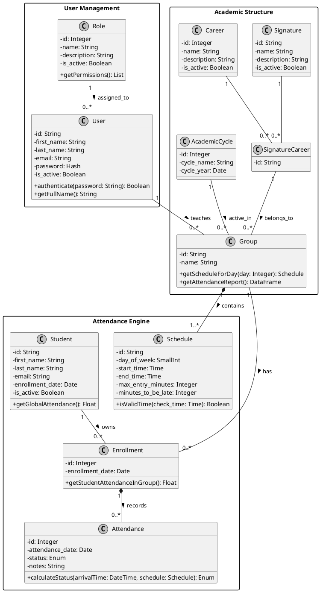

# Diagramas MER-MR y de Clases

>Este documento son mis notas, no es entregable, solo los diagramas ER y de clases son entregables
>Sólo es para una breve explicación si es que les sirve :p

>[!IMPORTANT]
>El diagrama MER no se hizo, ya que el MER es un diagrama que muestra las tablas con sus atributos de forma mas gráfica, se hacía muy grande y muy engorroso hacerlo.
>Es como los bosquejos inciales que anexe pero más detallado, por lo que no lo haré. Lo siento :(

## MR y MER
El MR (**Modelo Relacinal**) es una representación gráfica de la estructura de una base de datos, mostrando las entidades, sus atributos y las relaciones entre ellas.

En el contexto del **Sistema de Asistencias de la UBBJ**, el MER incluiría entidades como "Estudiante", "Profesor", "Asignatura", "Grupo",
"Ciclo Académico", entre otras, y las relaciones entre ellas, como "Un estudiante se inscribe en un grupo" o "Un profesor imparte una asignatura".

>Se hizo en inglés por convención :P

### Bosquejos iniciales

Fue un bosquejo rápido para tener una idea de cómo se relacionan las entidades, ya que si no me salía bien, no quería estar corrigiendo a cada rato.

Además, en el caso que saliera bien, luego tenía que hacer un proceso llamado **Normalización**, que en resumen, es un proceso para eliminar la redundancia de datos y duplicidades en las tablas de la base de datos.

Pero al final si salió bien, Gemini únicamente me dio correción de tipos de datos y agregar 2 tablas intermedias para eliminar las duplicidades.
>A que si soy bueno programando ¿no? :p

Únicamente use llaves primarias (**PK**s), llaves foráneas (**FK**s) y 1 que 2 atributos, como dije, solo era un bosquejo rápido para tener una idea de cómo se relacionan las entidades, no me preocupé por los otros atributos ni nada:

>Se hizo en **Excalidraw**

### Modelo Relacional (MR)

## Diagrama de Clases

El diagrama de clases es una representación gráfica de las clases, sus atributos, métodos y las relaciones entre ellas en un sistema orientado a objetos (POO).

>Digrama hecho en **PlantText**, un editor UML en línea

El diagrama lo hizo Gemini, ya que sólo le pasé el diagrama MR, algunas de las funciones que tendrá el sistema y me dió el código para pegarlo en
PlantText.

El código esta aquí en [diagrama de clases UML](./diagrama-de-clases/plantuml_export_ubbj.puml), obvio que conforme avanza el desarrollo puede cambiar, pero de forma rápida, el código se ve así:

