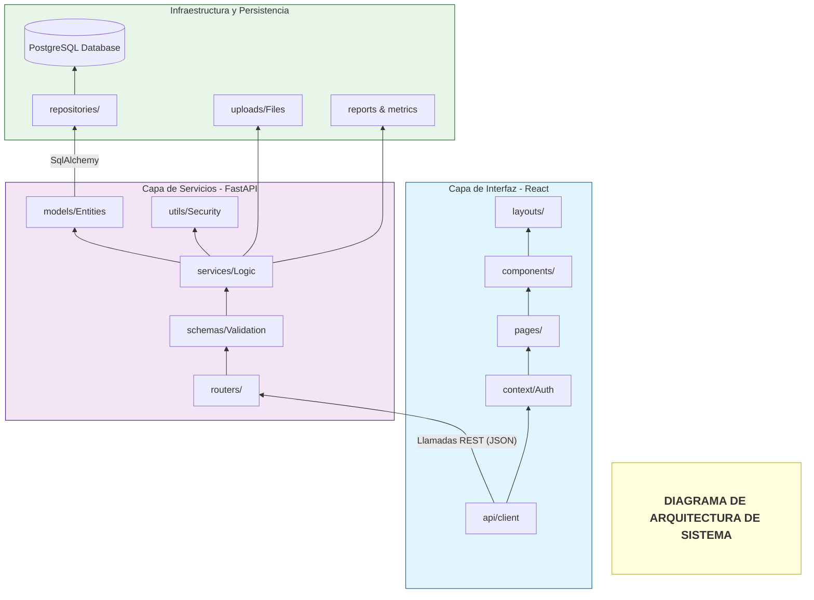

# Otros Diagramas

>Diagramas solicitados para el Manual del Analista. Se explicará que es eso en la otra sección :)

Diagramas para completar el modelado:

* Diagrama de arquitectura del sistema.
* Diagrama de actividades.
* Diagrama de secuencias.
* Diagrama de carriles-flujo Swimlane
* Diagrama de DFD completos (contexto-nivel 0, nivel 1 y nivel 2 completos no solo los principales), ojo estos no son los de flujos de progra 1 que se realizaban con los algoritmos.
* Diagrama de componentes.

>En este Markdown sólo incluiré una vista previa de los diagramas y el código para generarlo si es que la herramienta de modelado lo usa

## Diagrama de Arquitectura

Diagrama hecho en [Mermaid](https://mermaid.live/edit):




## Diagrama de Secuencia

Hecho en [Eraser](https://eraser.io/):


```eraser
// 1. Definicion de Actores
User [label: "Usuario / Admin", shape: person]
Frontend [label: "Frontend (React)", icon: react]
Backend [label: "Backend (FastAPI)", icon: fastapi]
DB [label: "PostgreSQL", icon: postgresql]

// FLUJO 1: LOGIN
User > Frontend: Ingresa credenciales
Frontend > Backend: POST /login
Backend > Backend: Validar credenciales y generar JWT
Backend > DB: Consultar usuario
DB > Backend: Retorna datos de perfil
Backend > Frontend: Retorna Token JWT
Frontend > User: Redirige al Dashboard

// FLUJO 2: ASISTENCIA
User > Frontend: Confirma su entrada
Frontend > Backend: POST /asistencia (JWT)
Backend > Backend: Calcular puntualidad y lógica
Backend > DB: Guardar registro de asistencia
DB > Backend: Confirmacion de guardado
Backend > Frontend: JSON status puntualidad
Frontend > User: Muestra mensaje de exito

// FLUJO 3: REPORTES
User > Frontend: Accede a modulo reportes
Frontend > Backend: GET /reportes (Filtros JWT)
Backend > DB: SELECT registros filtrados
DB > Backend: Retorna lista de asistencias
Backend > Backend: Procesar metricas y estadisticas
Backend > Frontend: Datos procesados JSON
Frontend > User: Renderiza graficas y metricas
```

## Diagrama de Carriles - Swimlane

Hecho en [Eraser](https://eraser.io/):


```eraser
// 1. Definición de la estructura de carriles
pool sistema-Asistencia {
  lane "Usuario o Admin" {
    U1 [label: "Ingresa Credenciales"]
    U2 [label: "Confirma Asistencia"]
    U3 [label: "Solicita Reportes"]
  }
  lane "Frontend (React)" {
    F1 [label: "Petición Login"]
    F2 [label: "Petición Asistencia"]
    F3 [label: "Renderiza Interfaz"]
  }
  lane "Backend (FastAPI)" {
    B1 [label: "Valida JWT y Negocio"]
    B2 [label: "Procesa Métricas"]
  }
  lane "Base de Datos (Postgres)" {
    D1 [label: "Consulta y Guardado"]
  }
}

// 2. Definición de los flujos de flechas
U1 -> F1
F1 -> B1
B1 -> D1
D1 -> B1: Datos usuario
B1 -> F1: Token JWT
F1 -> U1: Dashboard

U2 -> F2
F2 -> B1: Datos + JWT
B1 -> D1: Insert Registro
D1 -> B1: OK
B1 -> F2: Estatus
F2 -> U2: Éxito

U3 -> F3
F3 -> B2
B2 -> D1: Select
D1 -> B2: Registros
B2 -> F3: JSON Procesado
F3 -> U3: Gráficos
```

## DFDs

Hechos en [Eraser](https://eraser.io/).

### DFD Nivel 0: Diagrama de Contexto


```eraser
// Entidades Externas
Usuario [shape: rectangle]
Administrador [shape: rectangle]
SistemaAsistencia [label: "Sistema de Asistencia - UBBJ (Proceso 0)", shape: oval]

// Flujos de Datos
Usuario > SistemaAsistencia: Credenciales, Registro de Asistencia
SistemaAsistencia > Usuario: Confirmación, Estatus de puntualidad

Administrador > SistemaAsistencia: Solicitud de Reportes, Filtros
SistemaAsistencia > Administrador: Reportes PDF/Excel, Métricas
```

### DFD Nivel 1: Diagrama de Nivel 1 con Módulos Principales


```eraser
// --- ENTIDADES EXTERNAS ---
Usuario [shape: rectangle]
Administrador [shape: rectangle]

// --- ALMACENES DE DATOS (DATASTORES) ---
D1_Usuarios [label: "D1: Tabla Usuarios (Credenciales/Roles)", shape: storage]
D2_Asistencias [label: "D2: Tabla Asistencias (Registros/Métricas)", shape: storage]
D3_Archivos [label: "D3: Sistema de Archivos (Uploads/Exports)", shape: storage]
D4_Logs [label: "D4: Logs del Sistema (Monitoreo)", shape: storage]

// --- PROCESOS DETALLADOS (BURBUJAS) ---

// Módulo de Acceso
P1_1 [label: "2.1 Validar JWT & Permisos", shape: oval]
P1_2 [label: "2.2 Verificar Credenciales", shape: oval]

// Módulo de Lógica de Asistencia
P2_1 [label: "2.3 Saneamiento de Datos Entrada", shape: oval]
P2_2 [label: "2.4 Motor de Cálculo de Puntualidad", shape: oval]
P2_3 [label: "2.5 Registro de Evento en DB", shape: oval]

// Módulo de Archivos y Reportes
P3_1 [label: "2.6 Procesador de Carga Excel", shape: oval]
P3_2 [label: "2.7 Generador de Reportes y Exportación", shape: oval]
P3_3 [label: "2.8 Analizador de Métricas", shape: oval]

// --- FLUJOS DE DATOS (EL VIAJE DE LA INFORMACIÓN) ---

// Flujo de Autenticación
Usuario > P1_2: Formulario Login (JSON)
P1_2 <> D1_Usuarios: Hash de Password / Rol
P1_2 > Usuario: Token JWT Firmado
P1_2 > D4_Logs: Registro de Intento de Acceso

// Flujo de Registro de Asistencia
Usuario > P1_1: Petición Asistencia + JWT
P1_1 > P2_1: ID_Usuario Validado
P2_1 > P2_2: Datos Limpios + Timestamp
P2_2 <> D2_Asistencias: Horarios Configurables
P2_2 > P2_3: Resultado (Puntual/Retardo)
P2_3 > D2_Asistencias: Insert Registro
P2_3 > Usuario: Respuesta JSON de confirmación

// Flujo de Carga Masiva (Excel)
Administrador > P3_1: Archivo .xlsx (Uploads)
P3_1 > D3_Archivos: Guardar Archivo Físico
P3_1 > P2_3: Datos Extraídos para Inserción Masiva

// Flujo de Reportes y Estadísticas
Administrador > P1_1: Solicitud de Reporte + JWT
P1_1 > P3_3: Permiso Admin Validado
P3_3 <> D2_Asistencias: Datos Históricos
P3_3 > P3_2: Datos Agregados (Cómputo)
P3_2 > D3_Archivos: Crear PDF/Excel Temporal
P3_2 > Administrador: Descarga de Reporte / Dashboard
```

### DFD Nivel 2: Detalle de Procesos Internos


```eraser
// --- ENTIDADES EXTERNAS ---
Usuario [shape: rectangle]
Administrador [shape: rectangle]

// --- ALMACENES DE DATOS (DATASTORES) ---
D1_Usuarios [label: "D1: Tabla Usuarios (Credenciales/Roles)", shape: storage]
D2_Asistencias [label: "D2: Tabla Asistencias (Registros/Métricas)", shape: storage]
D3_Archivos [label: "D3: Sistema de Archivos (Uploads/Exports)", shape: storage]
D4_Logs [label: "D4: Logs del Sistema (Monitoreo)", shape: storage]

// --- PROCESOS DETALLADOS (BURBUJAS) ---

// Módulo de Acceso
P1_1 [label: "2.1 Validar JWT & Permisos", shape: oval]
P1_2 [label: "2.2 Verificar Credenciales", shape: oval]

// Módulo de Lógica de Asistencia
P2_1 [label: "2.3 Saneamiento de Datos Entrada", shape: oval]
P2_2 [label: "2.4 Motor de Cálculo de Puntualidad", shape: oval]
P2_3 [label: "2.5 Registro de Evento en DB", shape: oval]

// Módulo de Archivos y Reportes
P3_1 [label: "2.6 Procesador de Carga Excel", shape: oval]
P3_2 [label: "2.7 Generador de Reportes y Exportación", shape: oval]
P3_3 [label: "2.8 Analizador de Métricas", shape: oval]

// --- FLUJOS DE DATOS (EL VIAJE DE LA INFORMACIÓN) ---

// Flujo de Autenticación
Usuario > P1_2: Formulario Login (JSON)
P1_2 <> D1_Usuarios: Hash de Password / Rol
P1_2 > Usuario: Token JWT Firmado
P1_2 > D4_Logs: Registro de Intento de Acceso

// Flujo de Registro de Asistencia
Usuario > P1_1: Petición Asistencia + JWT
P1_1 > P2_1: ID_Usuario Validado
P2_1 > P2_2: Datos Limpios + Timestamp
P2_2 <> D2_Asistencias: Horarios Configurables
P2_2 > P2_3: Resultado (Puntual/Retardo)
P2_3 > D2_Asistencias: Insert Registro
P2_3 > Usuario: Respuesta JSON de confirmación

// Flujo de Carga Masiva (Excel)
Administrador > P3_1: Archivo .xlsx (Uploads)
P3_1 > D3_Archivos: Guardar Archivo Físico
P3_1 > P2_3: Datos Extraídos para Inserción Masiva

// Flujo de Reportes y Estadísticas
Administrador > P1_1: Solicitud de Reporte + JWT
P1_1 > P3_3: Permiso Admin Validado
P3_3 <> D2_Asistencias: Datos Históricos
P3_3 > P3_2: Datos Agregados (Cómputo)
P3_2 > D3_Archivos: Crear PDF/Excel Temporal
P3_2 > Administrador: Descarga de Reporte / Dashboard
```