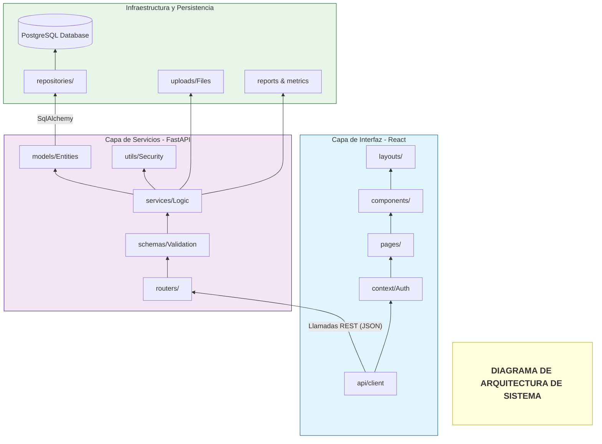

# Diagrama de Arquitectura

Diagrama hecho en [Mermaid](https://mermaid.live/edit):

```mermaid
---

config:
  layout: dagre
---
flowchart BT
 subgraph T[" "]
    direction TB
        Title["<b>DIAGRAMA DE ARQUITECTURA DE SISTEMA</b>"]
  end
 subgraph Frontend["Capa de Interfaz - React"]
    direction TB
        B["components/"]
        A["pages/"]
        C["layouts/"]
        D["context/Auth"]
        E["api/client"]
  end
 subgraph Backend["Capa de Servicios - FastAPI"]
    direction TB
        G["schemas/Validation"]
        F["routers/"]
        H["services/Logic"]
        I["models/Entities"]
        J["utils/Security"]
  end
 subgraph Data["Infraestructura y Persistencia"]
    direction TB
        K["repositories/"]
        L[("PostgreSQL Database")]
        M["uploads/Files"]
        N["reports & metrics"]
  end
    A --> B
    B --> C
    D --> A
    E --> D
    E -- Llamadas REST (JSON) --> F
    F --> G
    G --> H
    H --> I & J & M & N
    I -- SqlAlchemy --> K
    K --> L

    style Title fill:none,stroke:none,font-size:20px
    style Frontend fill:#e1f5fe,stroke:#01579b
    style Backend fill:#f3e5f5,stroke:#4a148c
    style Data fill:#e8f5e9,stroke:#1b5e20
```
